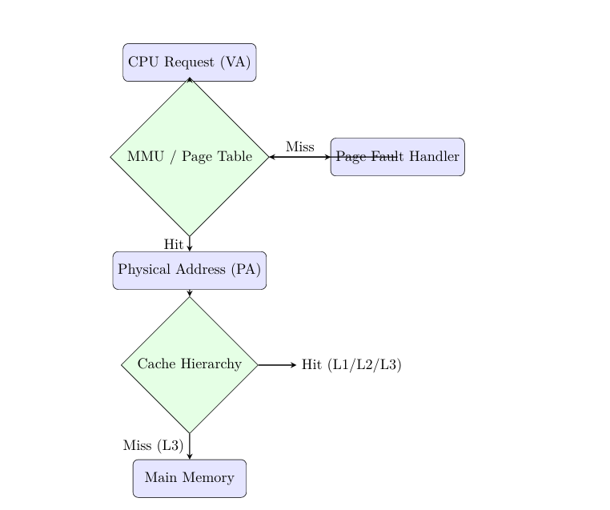

# Memory Management Simulator
ACM Open Project Winter 2025



A systems-level simulation of a computer's memory hierarchy, written in C++.

This project models the complete data path of a memory access request: starting from a CPU issuing a Virtual Address, passing through the MMU for translation, traversing a 3-level Cache Hierarchy, and finally accessing Physical Main Memory.

## Video Demonstration
Memory Management Simulator :  [https://youtu.be/qgLcO22deHU](https://youtu.be/qgLcO22deHU)
## Why this exists

I built this to visualize and test how different memory management strategies interact in a controlled environment. Operating system memory subsystems are opaque and often difficult to debug or modify without recompiling the kernel.

This tool isolates the logic for allocation, paging, and caching. It allows you to swap algorithms (e.g., changing L1 cache from LRU to FIFO, or switching the allocator from Best Fit to Buddy System) and immediately measure the impact on hit rates, latency, and fragmentation.

## How it works

The simulator runs an interactive CLI loop where you act as the OS/CPU, issuing commands to allocate memory or access specific addresses.

The system is composed of three distinct coupled modules:

### 1. Physical Memory Allocator

Manages the raw byte array representing RAM. You can switch between two implementations at runtime:

* **Free List:** A standard doubly linked list supporting **First Fit**, **Best Fit**, and **Worst Fit** strategies.
* **Buddy System:** A power-of-2 allocator that splits blocks recursively and coalesces buddies on free to minimize external fragmentation.

### 2. Virtual Memory Unit (MMU)

Handles the translation of Virtual Addresses (VA) to Physical Addresses (PA).

* Implements a hashed Page Table to simulate a sparse address space.
* Handles **Page Faults**: If a requested page isn't in memory, it evicts a victim page (using **FIFO** or **LRU**) and loads the new one.
* Simulates disk latency penalties for faults.

### 3. Cache Hierarchy

An inclusive 3-level cache system (L1, L2, L3) sits between the CPU and RAM.

* **L1:** Small, direct-mapped, 1-cycle latency.
* **L2:** Medium size, 2-way set associative, 10-cycle latency.
* **L3:** Large, 4-way set associative, 100-cycle latency.
* Tracks hits, misses, and evictions. Misses propagate down; evictions propagate up.

## Architecture & Data Flow

When you run an `access <virtual_address>` command, the flow follows this strict hardware path:

1. **Translation:** CPU requests VA  MMU translates to PA (triggering page faults if needed).
2. **Cache Lookup:** PA is checked against L1  L2  L3.
3. **Memory Access:** If L3 misses, data is fetched from Main Memory (RAM).
4. **Latency:** The simulator calculates total cycles consumed based on where the hit occurred.

## Installation

You need a C++ compiler supporting C++11 (e.g., `g++`) and `make`.

### Build with Make (Linux/Mac/WSL)

```bash
make

```

### Manual Compilation (Linux/Mac/WSL)

If you prefer compiling directly:

```bash
g++ main.cpp src/cache/cache.cpp \-I include -I src/cache -I include/vm -I src/vm \-std=c++11 -o final_sim

```

## Usage

Run the executable to enter the interactive shell:

```bash
./final_sim

```

### Common Commands

**Memory Management**

```bash
init 2048                # Initialize RAM to 2048 bytes
set allocator buddy      # Switch to Buddy System
malloc 128               # Allocate 128 bytes
free 1                   # Free block ID 1
dump                     # Visualize memory layout

```

**CPU & Cache Operations**

```bash
vm policy lru            # Set Page Replacement to LRU
cache policy L1 fifo     # Set L1 Cache to FIFO
access 0                 # Read Virtual Address 0 (triggers translation + cache)
stats system             # View Cache Hit Rates and Page Faults

```

### Automated Testing

I included an integration test script that verifies all features (allocators, cache hits, VM faults) in a single run.

**On Linux/Mac:**

```bash
./run_tests.sh

```

**On Windows (PowerShell):**

```powershell
.\run_tests.ps1

```

## Limitations

* **Single-Threaded:** The simulator is not thread-safe.
* **No TLB:** Address translation goes directly to the Page Table; a Translation Lookaside Buffer is not currently modeled.
* **Volatile Data:** The cache stores tags and valid bits to simulate logic, but it doesn't store actual data payloads.
